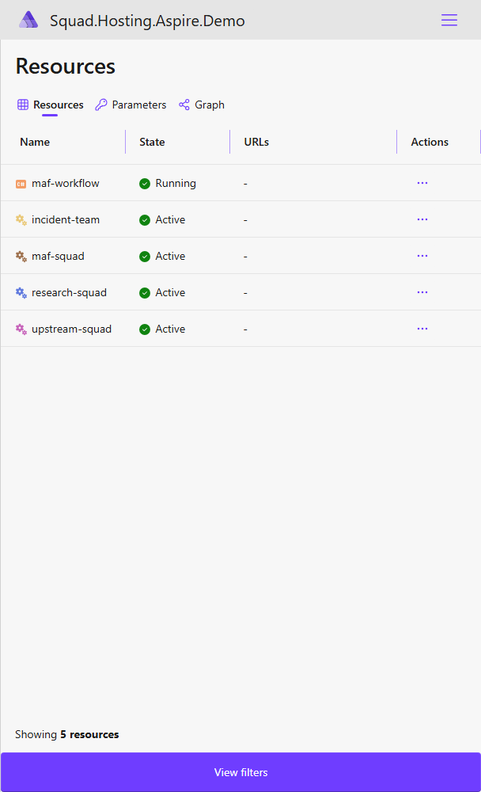
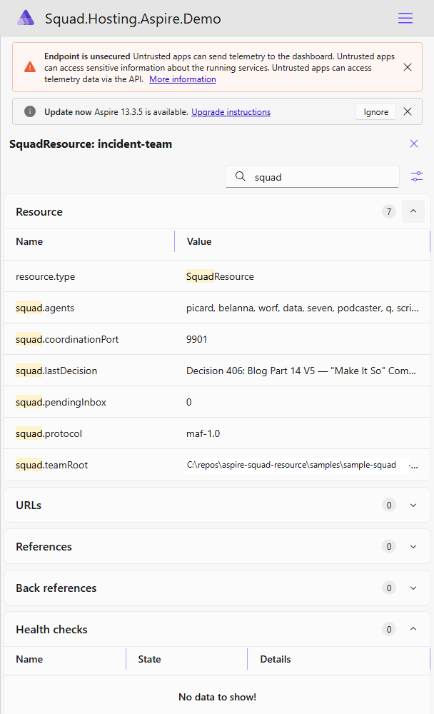
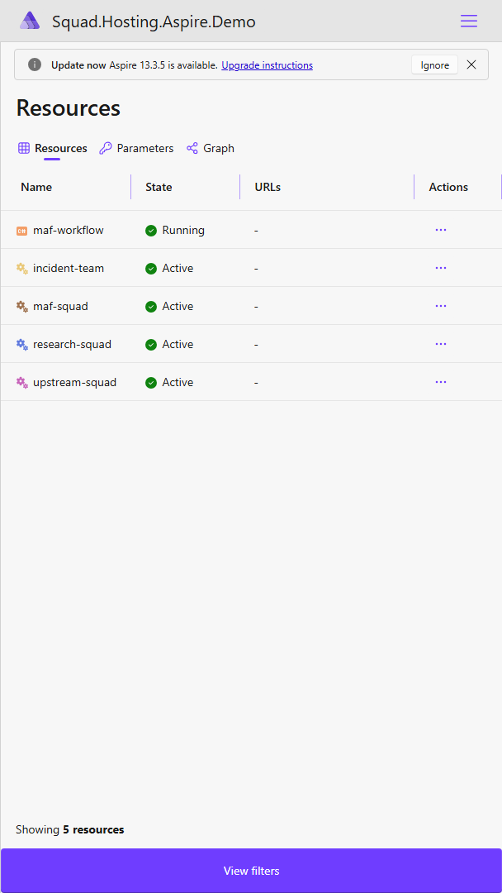
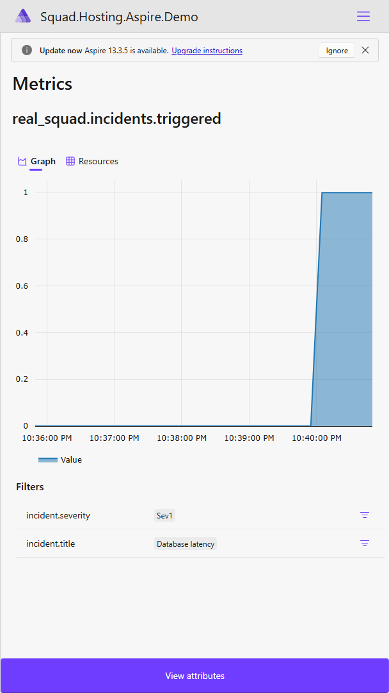
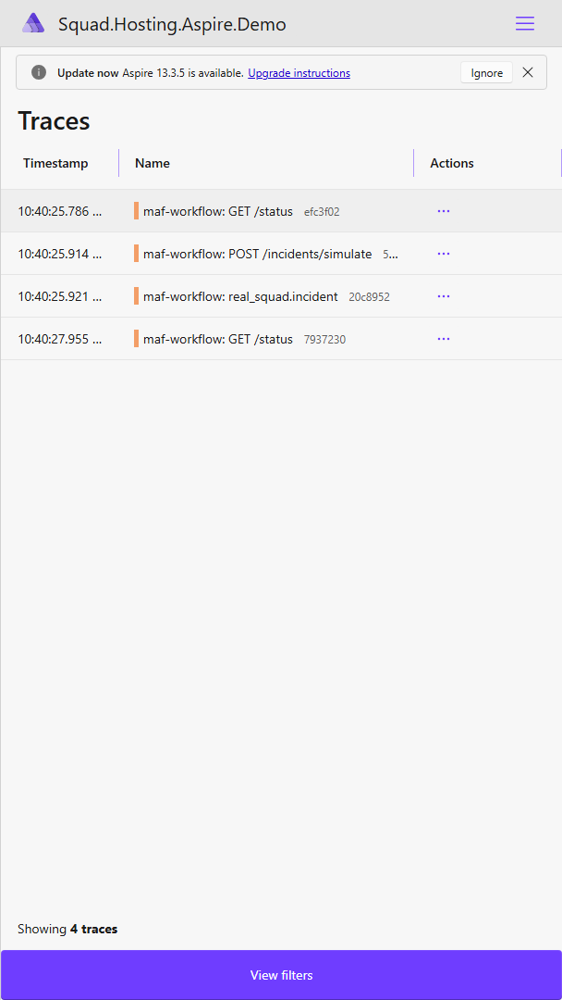
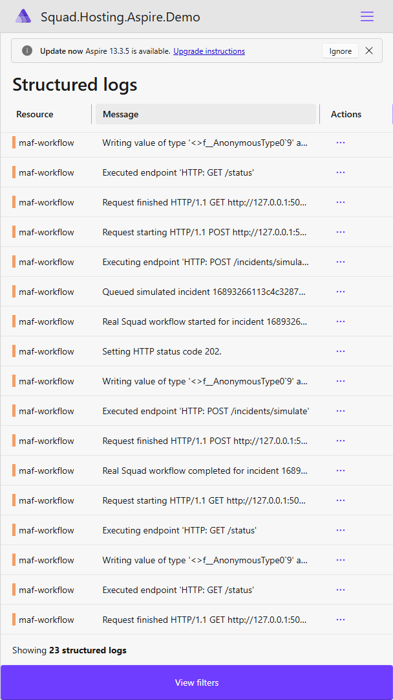
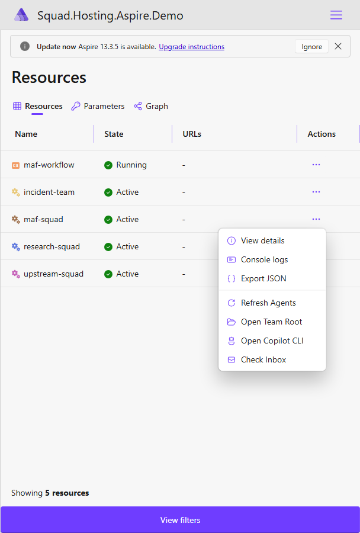

# builder.AddSquad(): Making Your AI Agent Team First-Class .NET Aspire Infrastructure

*May 2026 · Tamir Dresher*

---

Let me tell you about the thing that bothered me after I got the previous demo working.

In ["Deterministic Meets Squads"](https://www.tamirdresher.com/blog/2026/05/21/deterministic-meets-squads), I showed Squad running alongside a .NET Aspire application. The workflow had deterministic code doing the boring-but-important parts, and Squad stepped in for the judgment work. The telemetry made that split visible. It worked. The screenshots were real. I was happy.

But "alongside" was doing a lot of work in that sentence.

Squad was not really part of the Aspire application model. It was something next to it. A companion. A helpful gremlin in the engine room. Useful, yes, but not a first-class resource you could point at in `AppHost.cs`.

And if something is important enough for my workflow to depend on, it should be important enough for Aspire to know about.

That is the thesis of this post: **Squad should be a first-class Aspire resource.**

Not because it makes the code prettier, although it does. Not because I enjoy adding extension methods to things, although apparently I do. But because the dashboard changes the story. Once Squad appears as a resource, you stop thinking about it as a bag of agent processes and start thinking about it as infrastructure your application can reference, inspect, and reason about.

The screenshot is the punchline:



That view is intentionally boring in the best possible way. It shows one row per squad: `research-squad`, `incident-team`, `maf-squad`, and, when an optional upstream clone is configured, `upstream-squad`. It also shows the MAF workflow as its own long-running project resource, `maf-workflow`, sitting next to the squads it references. Not one row per agent. Not a dashboard turned into a Where's Waldo book of Ralph, Seven, Picard, Worf, Data, B'Elanna, and friends. One squad is one resource.

That design decision matters.

Agents are the implementation detail. The squad is the thing the rest of the system depends on.

## The Problem: Squad Was Outside the Resource DAG

In Aspire, the resource graph is the center of gravity. It is how you say "this project needs that database" or "this worker should not start until the queue exists." It is how the dashboard knows what is running, what is waiting, and what has gone sideways.

Before this experiment, Squad was not in that graph. My workflow could call into Squad, but Aspire could not see Squad as a resource. That meant no resource row, no resource properties, no dashboard commands, and no natural place to put the team metadata that tells me which agents are available.

The old shape looked roughly like this:

```csharp
var foundry = builder.AddFoundry("foundry").RunAsFoundryLocal();
var chat = foundry.AddDeployment("chat", "phi-3.5-mini", "1", "Microsoft");

builder.AddProject<Projects.IncidentWorkflow>("incident-workflow")
    .WithReference(chat)
    .WaitFor(chat);

// Squad agents: started separately, somewhere outside the AppHost story.
```

That works until it doesn't. Which is basically the subtitle of every distributed systems demo ever given five minutes before a live audience joins the call.

The fix was to make the squad itself a resource.

## The Shape I Wanted: `builder.AddSquad("team")`

The API should feel like every other Aspire hosting integration:

```csharp
builder.AddSquad(
    "research-squad",
    teamRoot: @"C:\repos\my-squad-project");

builder.AddSquad(
    "incident-team",
    teamRoot: repoRoot);
```

That is the whole point. The AppHost now says, out loud, "these squads are part of this distributed application."

Under the covers, `SquadResource` implements `IResourceWithConnectionString`, so the resource has a real Aspire identity and a descriptor expression:

```text
squad://resource/research-squad?teamRoot=...&agents=ralph%2Cseven%2Cpicard&protocol=maf-1.0
```

Important clarification: `squad://` is not a public network protocol and it is not proof that the squad resource has started a web server. In this phase, it is an Aspire connection-string-shaped descriptor for the logical squad resource. It carries the resource name, team root, agent roster, and descriptor version so a downstream workflow can understand which squad it was wired to. The resource itself does not bind a port or host an HTTP API.

I am not claiming the entire production orchestration story is finished here. This demo proves a smaller, more concrete thing: the squad can be represented as an Aspire resource, can expose team metadata, can publish a state in the dashboard, can provide a connection string, and can attach dashboard commands. That is the foundation. The rest is where the fun begins, and by "fun" I mean "future me will pretend he enjoys lifecycle edge cases."

## The Dashboard Is the Story

The most important change is not the code. It is what the dashboard now communicates.

When the demo AppHost runs, Aspire shows squad resources in the resource list. Again, the key detail is this:

> The dashboard shows one row per squad, not one row per agent.

That was deliberate. I considered making every agent a child resource, because that is the kind of thing that feels clever at 1:00 AM and then becomes a maintenance tax by breakfast. The first useful dashboard view is not "show me every agent as a separate top-level resource." The first useful view is "show me the squads my application depends on."

The agents still matter, of course. They show up in the resource details where they belong:



That details panel is where the roster belongs because it answers the second question, not the first one.

The first question is: *which squads are running in this application?*

The second question is: *who is inside this squad?*

Keeping those two questions separate makes the dashboard readable. A ten-agent team stays one resource row. A multi-squad demo stays a short list of squad resources. My brain, which already has too many browser tabs open, appreciates this small mercy.

The resource properties are also the bridge between the screenshot and the code. The lifecycle hook publishes properties like:

```text
squad.teamRoot
squad.agents
squad.protocol
squad.pendingInbox
squad.lastDecision
```

So the dashboard is not just saying "trust me, there is a squad." It can show the team root it loaded, the agent roster it discovered, the descriptor protocol version, and a little bit of live file-based metadata from the squad workspace.

That is exactly the level of proof I wanted from this phase.

## The Multi-Squad Demo

The current demo AppHost wires up more than one squad resource on purpose. I wanted the screenshot to tell the story without needing a five-minute architecture diagram first.

There is a `research-squad`, an `incident-team`, and a `maf-squad`, which is the squad resource that the MAF example workflow references. The public sample points them at a synthetic `.squad` workspace under `samples\sample-squad`, but they remain separate logical resources with separate descriptor identities:

```csharp
builder.AddSquad("research-squad",
    teamRoot: sampleSquadRoot);

builder.AddSquad("incident-team",
    teamRoot: repoRoot);

var mafSquad = builder.AddSquad("maf-squad",
    teamRoot: sampleSquadRoot);
```

This is the part I wanted the screenshot to make obvious: Aspire is not showing "a Squad integration." It is showing multiple concrete squad instances. Each row represents a different team root, a different roster, and a different resource identity.

What those rows do not mean yet: each squad row is not an independently running squad server. The actual long-running HTTP listener in this demo is `maf-workflow`, the `demos/squad-in-a-box` project resource shown next to the squads.

That is the resource model doing its job.

It also keeps the mental model clean for future topologies. An incident workflow might depend on `incident-team`. A research workflow might depend on `research-squad`. A different application might reference a domain-specific squad. The AppHost becomes the place where that topology is declared instead of a README paragraph that says "start these things in this order and please don't sneeze."

## Putting the MAF Workflow in the Same Dashboard

This is the part that makes the dashboard proof more honest. The MAF example workflow should not live in a separate terminal window while the squads show up in Aspire. If the workflow is using Squad, it should appear in the same application model as the squad resource it depends on.

So the demo AppHost also wires the `demos/squad-in-a-box` project into the resource graph:

```csharp
builder.AddProject<Projects.SquadInABox>("maf-workflow")
    .WithReference(mafSquad)
    .WithArgs("--real-squad", "--team-root", sampleSquadRoot);
```

`maf-workflow` hosts the real-Squad MAF adapter proof as a tiny web app against the same `.squad` workspace represented by `maf-squad`. It stays alive for dashboard inspection, and `POST /incidents/simulate` can trigger the workflow from the running resource instead of requiring a separate terminal.

That gives the demo a complete observability loop in the dashboard: process/resource state, the incident trigger response, console output from the workflow, structured logs, traces, metrics, and the resource graph all come from the same running AppHost.









I am being careful about the claim here: this is not yet saying Aspire orchestrates every Copilot process as an individual child resource. The proof is smaller and more useful for this phase: the workflow resource and the squad resource are both in the Aspire graph, and the workflow receives the squad reference through the AppHost topology.

## Loading a Public Upstream Squad When the Clone Exists

There is one small trick in the demo that I like because it feels very Aspire-y: an optional additional squad.

If I have a local clone of the public upstream Squad repository and set `UPSTREAM_SQUAD_ROOT`, the AppHost adds it as its own resource:

```csharp
var upstreamSquadRoot = Environment.GetEnvironmentVariable("UPSTREAM_SQUAD_ROOT");
if (!string.IsNullOrWhiteSpace(upstreamSquadRoot) && Directory.Exists(upstreamSquadRoot))
{
    builder.AddSquad("upstream-squad",
        teamRoot: upstreamSquadRoot);
}
else
{
    Console.WriteLine(
        "Skipping upstream-squad resource; set UPSTREAM_SQUAD_ROOT to a local Squad clone to include it.");
}
```

This does not download anything. It does not make the demo depend on a repo that may not exist on the machine running it. It simply says: if the public upstream clone is available locally, treat that squad as another resource in the Aspire app.

That is a nice little demo of what I want from the integration. A squad is not hardcoded into the application forever. It is a resource instance with a name and a team root. Point it at a different clone, and you get a different squad resource.

No magic. No ceremony. Just enough structure to make the dashboard honest.

## Commands: The Dashboard Gets Buttons

The second screenshot I want in this post is the commands panel, because it shows the next level of integration. Once Squad is an Aspire resource, I can attach operations directly to the resource row.



The demo registers four commands:

```csharp
resourceBuilder
    .WithCommand("refresh-agents", "Refresh Agents", ...)
    .WithCommand("open-team-root", "Open Team Root", ...)
    .WithCommand("open-copilot-cli", "Open Copilot CLI", ...)
    .WithCommand("check-inbox", "Check Inbox", ...);
```

These are intentionally humble. **Refresh Agents** reports the roster loaded from `.squad/team.md`. **Open Team Root** opens the configured workspace. **Open Copilot CLI** opens a terminal in that workspace and starts the GitHub Copilot CLI, so the dashboard can hand you directly into an interactive squad session. **Check Inbox** counts pending `.md` files in `.squad/decisions/inbox/`.

That may not sound glamorous, but this is exactly the kind of thing that makes a dashboard useful. I do not want to remember where the team root is. I do not want to spelunk through Explorer to see whether the inbox has pending decisions. I want the resource row to give me the operations that make sense for that resource.

Also, "Check Inbox" as a dashboard button is dangerously close to giving Ralph a doorbell, and I am not emotionally prepared for that level of agency yet.

## What This Proves, and What It Does Not

This is where I need to be precise, because the demo is useful but it is not a license to declare victory over all observability forever.

The current code and screenshots prove that:

- `builder.AddSquad(...)` can add multiple named squad resources to an Aspire AppHost.
- Each squad resource can point at a different local team root.
- The Aspire dashboard can show one row per squad.
- A MAF workflow project can appear in the same dashboard and reference a squad resource.
- The squad workflow is a real `Microsoft.Agents.AI.AIAgent` implementation (single `SquadAgent` class wrapping `GitHub.Copilot.SDK`), not a placeholder.
- Triggering an incident from the dashboard constructs 12 native MAF agents from the `.squad` charters and runs a real coordinator → subagent handoff with the prompts and per-subagent response summaries visible in `/trace` and in Aspire traces (when `--trace-raw-copilot-content` is enabled).
- Agent rosters can be exposed as resource properties instead of top-level resource rows.
- The resource can provide a custom `squad://resource/...` descriptor expression without implying a bound host or port.
- Dashboard commands can be attached to the squad resource.
- A public upstream clone can be represented as another squad resource when that clone exists locally.

That is enough for the thesis of this post.

There are still bigger questions for a production-quality package: deeper lifecycle management, real child-process orchestration, richer health semantics, and full OpenTelemetry wiring from the agent processes themselves. Those are important. They are also not what this screenshot proves, and I do not want to smuggle future work into present-tense claims. That way lies enterprise architecture decks, and nobody wants that before coffee.

## Why This Matters

The previous post was about a pattern: AI for judgment, code for everything else.

This post is about the infrastructure shape that makes that pattern maintainable.

If Squad is just a script I run before the demo, then every workflow that depends on it inherits a little invisible assumption. If Squad is a resource, the assumption becomes visible. It gets a name. It gets properties. It gets commands. It gets a row in the dashboard next to the other things the application needs.

That sounds small, but small is how infrastructure becomes trustworthy.

The dashboard screenshot is the story because it turns Squad from "the agents are somewhere over there" into "these are the squads in this application."

And once I can see them, I can start treating them like the infrastructure they already are.

---

*The implementation in this worktree demonstrates multiple Squad resources side-by-side using `builder.AddSquad()`. The screenshots referenced here were captured from the running demo AppHost.*

*Code: [aspire-squad-resource](https://github.com/tamirdresher/aspire-squad-resource) · Previous post: [Deterministic Meets Squads](https://www.tamirdresher.com/blog/2026/05/21/deterministic-meets-squads)*
